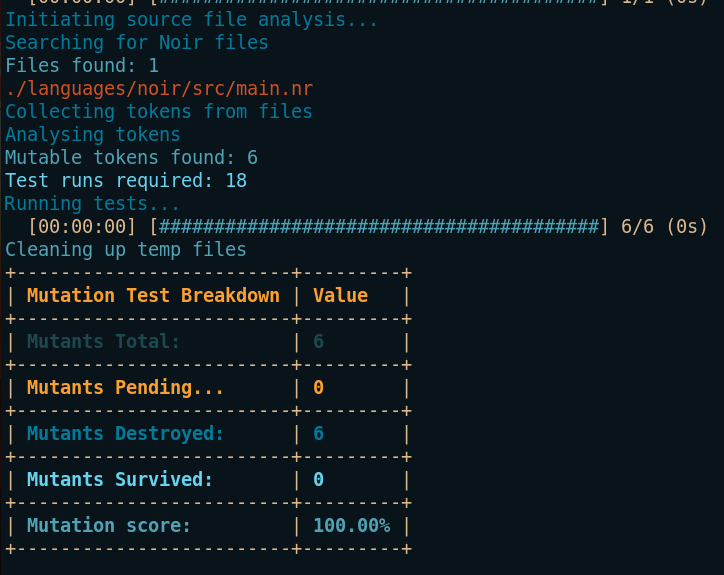

# Hunter

A Rust CLI mutation-testing tool for Noir source code.

## Disclaimer

> !!! Note: Hunter is currently in its alpha stage of development. While functional, it is still under active development. This means that there may be bugs and/or significant changes. It is not recommended to use this tool in a production environment or for securing code that protects valuable assets. Hunter, like many mutation testing tools, is designed to assist in writing improved tests. It is NOT a substitute for creating tests or conducting thorough code reviews.
## Inspiration

[Vertigo](https://github.com/JoranHonig/vertigo) A mutation testing tool for Solidity x Truffle by Joran Honig

[Guide to mutation testing](https://testrigor.com/blog/understanding-mutation-testing-a-comprehensive-guide/) bt Artem Golubev

[Mutation Testing at scale](https://homes.cs.washington.edu/~rjust/publ/practical_mutation_testing_tr_2021.pdf) by Goran Petrovi´c, Marko Ivankovi´c, Gordon Fraser, René Just

## Overview

At a high level, Hunter exposes a CLI with 2 primary commands, scan and mutate. The former is like a dry-run, giving quick feedback on which eligible files were found, the number of mutation candidates, the number of tests required, etc. The mutate command takes the result of the scan, applies the mutations, runs the tests, and generates a report.

## Installation

There are 2 ways to install Hunter: via cURL or by building from source.

### cURL

1. Download the installation script using cURL:
`curl -LO https://github.com/nfurfaro/hunter/blob/master/scripts/install.sh | bash`

2. Make the script executable:
`chmod +x install.sh`

3. run the script:
`./install.sh`

This will install the binary to `/usr/local/bin`.
You should now be able to run the program by typing `hunter` in your terminal!

### Build from source

Alternatively, you can build Hunter from source. To do so, you'll need to have Rust installed. If you don't have Rust installed, you can install it by following the instructions [here](https://www.rust-lang.org/tools/install).

1. Clone the repo:
`git clone git@github.com:nfurfaro/hunter.git`

2. Build the project:
`cargo build --release`

3. Move the binary to a directory in your PATH (i.e: /usr/local/bin):
`mv ./target/release/hunter /usr/local/bin`

You should now be able to run the program by typing `hunter` in your terminal!

## Quickstart

The simplest way to get started with Hunter is to `$ cd` into the root of the project you want to test. From there, it is recommended to run the scan command:
`$ hunter scan`. By default, this will scan the current directory and all subdirectories for Noir source files. It will then print a summary of the results to the terminal.

The next step is to run the mutate command:
`$ hunter mutate`. This will apply the mutations to the source code, run the tests, and generate a report. If the `scan` command indicated that there is a high number of test runs required, you may want to refer to the [filtering options](#filtering-options) section to limit the scope of the source code analysed.

## Help

To see Hunter's help menu, run `hunter --help`.

`hunter --info` will give some more context on the results of the `mutate` command.

## About Mutation Testing

At a high level, mutation testing is a way to measure the quality of a test suite.
It is possible to have 100% test coverage and still have poor quality/incomplete tests. Mutation testing helps to identify these cases.


Mutation testing involves modifying the source code of a program in small ways. Specifically, it modifies the program by replacing an operator with another operator. Each modification is called a mutant. For each mutant, we run the existing test suite against the mutated code. If at least one test fails, the mutant is "killed". If all tests pass, the mutant "survives". The mutation score is the percentage of mutants that are killed by the test suite, calculated as follows:

```mutation_score = (killed_mutants / total_mutants) * 100```

The closer the score is to 100%, the better the test suite is at detecting changes or errors in the source code.

To learn more about mutation testing, check out [this article](https://www.joranhonig.nl/introduction-into-mutation/).

## Assumptions and Limitations

Hunter assumes the following:

- the user has Nargo installed in their PATH.
- the test suite for the project you want to mutate is currently all passing. If there are failing tests, you're not ready to perform mutation testing yet!

The larger the project and test suites are, the longer the mutation testing run will take. By default, Hunter will run your entire test suite for each mutant generated (in parallel). See the [filtering options](#filtering-options) section for ways to limit the number of tests run per mutant.

> Note: Hunter currently only targets in-language unit tests written in the same file as the source they test. It does not currently support tests written in separate files or in a separate directory, but this is definitely a feature that is planned for the next release!

## Mutations

Hunter currently supports the following mutations:

### Arithmetic operators

`+`, `-`, `*`, `/`, and `%`.

### Bitwise operators

`!`, `&`, `|`, `^`, `<<`, and `>>`.

### Predicate/Comparison operators

`==`, `!=`, `>`, `>=`, `<`, and `<=`.

### Shorthand operators

`+=`, `-=`, `*=`, `/=`, `%=`, `&=`, `|=`, `^=`, `<<=`, and `>>=`.

## Mutation rules

Hunter currently takes the approach of using deterministic rules to determine which mutations to apply. This means that the same source code will always produce the same mutations. This is in contrast to probabilistic approaches, which randomly select mutations to apply. The advantage of deterministic rules is that it's easier to reason about the mutations that will be applied and limit the number of false positives(i.e: equivalent mutations) that are generated.

To see how Hunter currently determines which mutations to apply, check out the `./src/token.rs::token_transformer()` function.

## Output & Reporting Options

By default, Hunter will output all reports to the terminal.



For a larger project, it can be helpful to generate a report file. This can be achieved by passing the `--output-path` (`-o`) flag to the `mutate` command, and specifying a path to a file. For example, `hunter mutate --output-path ./hunter_report.md`. This will generate a markdown file with the report in table format mimicking the tables printed to stdout by default.

## Filtering Options

Hunter currently provides an option to filter the number of mutants generated by limiting the scope of source code analyzed. This can be useful for larger projects with a large number of tests. Using the `--source-path`(`-s`) flag, you can specify a path to a directory containing the source code you want to mutate. For example, `hunter mutate --source-path ./src/main.nr`will limit the scope of the source code analysed to the `./src/main.nr` file.
By using this targeted approach methodically, you can incrementally test your codebase and improve your test suite.
> Note: This is in contrast to the approach taken by some other mutation testing tools which is to optionally set the sample size, which then (non-deterministically) limits the number of mutants generated to cut down the run time.

## Excluded Directories

Hunter ignores the following directories by default:

`./temp`, `./target`, & `./test`

If you want to test source files in any of these directories, simply cd into the directory and run the `scan` or `mutate` command from there.
You will be prompted to choose if you want to continue, just select `yes`.
